<!--
 * @Author: your name
 * @Date: 2021-04-19 17:34:17
 * @LastEditTime: 2021-04-21 21:51:58
 * @LastEditors: Please set LastEditors
 * @Description: In User Settings Edit
 * @FilePath: \algorithm\Hanoi.md
-->
# 汉诺塔问题

- 转载请注明出处

## A、B、C大小相形同的3根石柱，其中A石柱从下往上按照大小顺序依次摆放着n个盘子，现在需要将A石柱的盘子全部移动到C石柱上，并且每次只能移动一个圆盘，大圆盘不能放在小圆盘上，请问该如何移动？

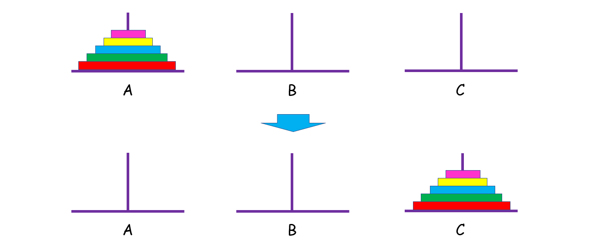</img>


## 解题思路

- <b>递归与分治
    >这是一道递归方法的经典题目，乍一想还挺难理清头绪的，我们不妨先从简单的入手。

    >假设 n = 1,只有一个盘子，很简单，直接把它从 A 中拿出来，移到 C 上；

    >如果 n = 2 呢？这时候我们就要借助 B 了，因为小盘子必须时刻都在大盘子上面，共需要 4 步。
    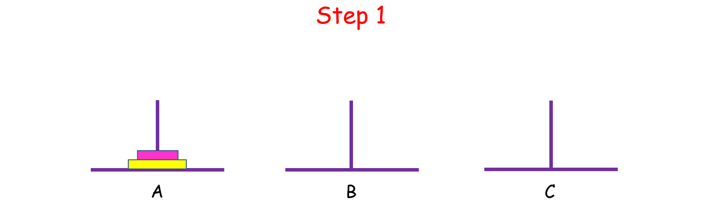</img>

    >如果 n > 2 呢？思路和上面是一样的，我们把 n 个盘子也看成两个部分，一部分有 1 个盘子，另一部分有 n - 1 个盘子。
    </img>

    >观察上图，你可能会问：“那 n - 1 个盘子是怎么从 A 移到 C 的呢？
    注意，当你在思考这个问题的时候，就将最初的 n 个盘子从 A 移到 C 的问题，转化成了将 n - 1 个盘子从 A 移到 C 的问题， 依次类推，直至转化成 1 个盘子的问题时，问题也就解决了。这就是分治的思想。

    >而实现分治思想的常用方法就是递归。不难发现，如果原问题可以分解成若干个与原问题结构相同但规模较小的子问题时，往往可以用递归的方法解决。具体解决办法如下：
    - n = 1 时，直接把盘子从 A 移到 C；
    - n > 1 时:
        - 先把上面 n - 1 个盘子从 A 移到 B（子问题，递归）；
        - 再将最大的盘子从 A 移到 C；
        - 再将 B 上 n - 1 个盘子从 B 移到 C（子问题，递归）。
    >代码实现
    ```javascript
    function Hanoi(A, B, C) {
        console.log(`A:${A}\nB:${B}\nC:${C}\n`);//输出ABC
        let n = A.length;
        let move = function (length, a, b, c) {
            //定义一个方法，含义是将a上的n个盘子通过b移动到c

            if (length === 1) { 
                // 当只有一个时直接加到c中
                c.push(a.pop())
                console.log(`A:${A}\nB:${B}\nC:${C}\n`);
            } else {
                move(length - 1, a, c, b) // 将 a 上的 n - 1 个 通过 c 移到 b

                c.push(a.pop()) // 把 a 中剩下的一个直接放到 c

                console.log(`A:${A}\nB:${B}\nC:${C}\n`);
            
                move(length - 1, b, a, c) // 在把 b 上的 n - 1 个 通过 a 放到 c
            }
        }
        move(n, A, B, C)
    }
    ```
    >输出的结果
    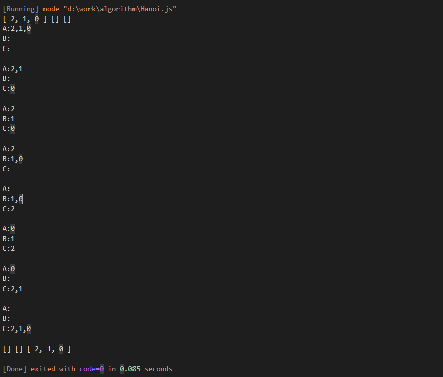

<br>
<br>

- <b>非递归算法

>1. 将三根柱子按顺序排成品字型，若 [公式] 为偶数，按顺时针方向依次摆放A、B、C；若 [公式] 为奇数，按顺时针方向依次摆放A、C、B。
>2. 把圆盘1从现在的柱子移动到顺时针方向的下一根柱。
>3. 接着，把另外两根柱上可以移动的圆盘移动到新的柱上（事实上只有唯一的选择）。
>4. 如果没有达到目标要求，则返回步骤2。

>下面列出n=3的情况图解

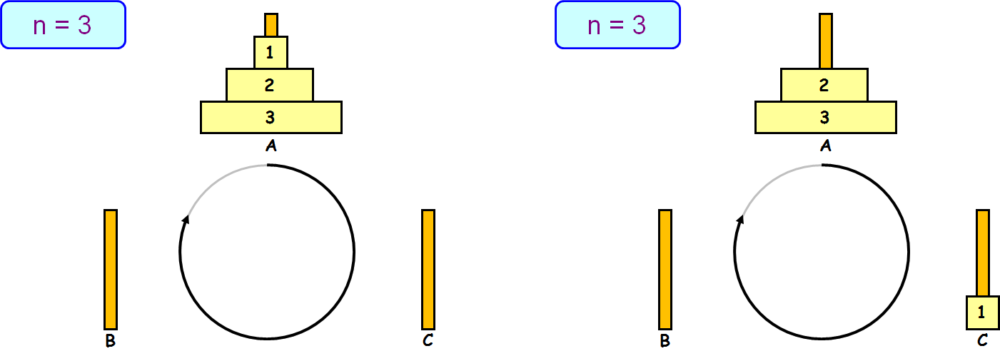
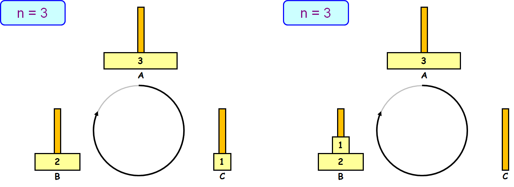
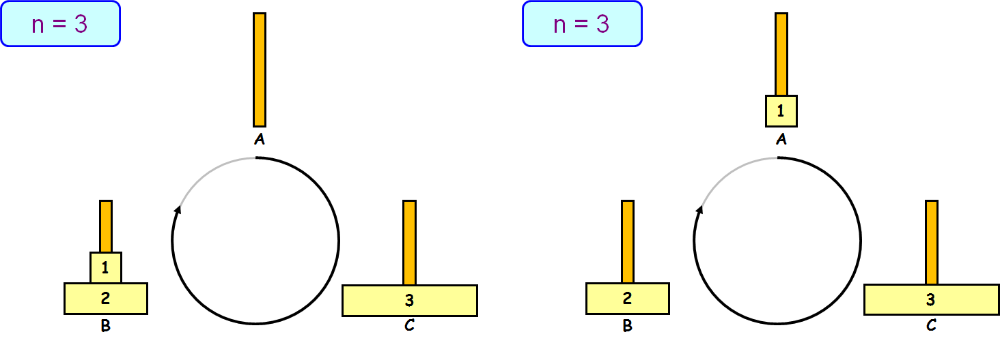
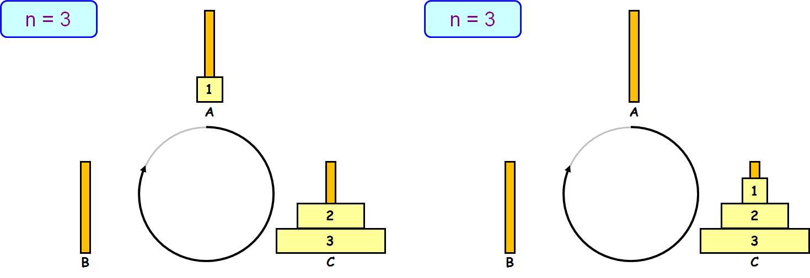

>代码实现
```javascript
var step = 0;

function PrintMoveOnePlate(n, loca1, loca2) {
    console.log("第" + ++step + "步：移动第" + n + "个盘子，从" + loca1 + "到" + loca2 + "\n");
}

function MovePlates(n, s, m, d) {
    //定义位置  
    var loop = new Array(3);
    loop[0] = new Array(n);
    loop[1] = new Array(n);
    loop[2] = new Array(n);
    //定义位置描述字符串数组(n为偶数的情况)  
    var loca = new Array(s, m, d);
    if (n % 2 != 0) //n为奇数的情况  
    {
        loca[1] = d;
        loca[2] = m;
    }
    //初始化源位置上的盘子  
    for (var i = 0; i < n; i++)
        loop[0][i] = n - i;
    //记录各个位置上盘子的数量  
    var loopLen = new Array(n, 0, 0);
    var count = Math.pow(2, n) - 1; //移动次数，即循环退出条件  
    var firstPlate = 0; //1号盘子的位置  
    do {
        //将1号盘子顺时针移动到后1个位置  
        PrintMoveOnePlate(1, loca[firstPlate], loca[(firstPlate + 1) % 3]); //显示移动过程  
        loop[(firstPlate + 1) % 3][loopLen[(firstPlate + 1) % 3]] = 1; //移动  
        loopLen[firstPlate]--; //修改1号盘子旧位置上盘子的数量  
        firstPlate = (firstPlate + 1) % 3; //修改1号盘子的位置  
        loopLen[firstPlate]++; //修改1号盘子新位置上盘子的数量  
        count--; //记录移动次数  
        //移动另外的两个位置上的盘子  
        if (count != 0) //避免最后一次移动后仍然移动而导致错误  
        {
            //确定另外两个位置如何移动  
            if (loopLen[(firstPlate + 1) % 3] == 0 || loopLen[(firstPlate + 2) % 3] != 0 &&
                loop[(firstPlate + 2) % 3][loopLen[(firstPlate + 2) % 3] - 1] < loop[(firstPlate + 1) % 3][loopLen[(firstPlate + 1) % 3] - 1]) { //1号盘子的后第1个位置为空，或者无空位置且1号盘子后第2个位置编号较小，此时将1号盘子后第2个位置的盘子移动到1号盘子后第1个位置上  
                PrintMoveOnePlate(loop[(firstPlate + 2) % 3][loopLen[(firstPlate + 2) % 3] - 1], loca[(firstPlate + 2) % 3], loca[(firstPlate + 1) % 3]); //显示移动过程  
                loop[(firstPlate + 1) % 3][loopLen[(firstPlate + 1) % 3]] = loop[(firstPlate + 2) % 3][loopLen[(firstPlate + 2) % 3] - 1]; //移动  
                loopLen[(firstPlate + 2) % 3]--; //修改该盘子旧位置上盘子的数量  
                loopLen[(firstPlate + 1) % 3]++; //修改该盘子新位置上盘子的数量  
            } else { //1号盘子的后第2个位置为空，或者无空位置且1号盘子后第1个位置编号较小，此时将1号盘子后第1个位置的盘子移动到1号盘子后第2个位置上  
                PrintMoveOnePlate(loop[(firstPlate + 1) % 3][loopLen[(firstPlate + 1) % 3] - 1], loca[(firstPlate + 1) % 3], loca[(firstPlate + 2) % 3]); //显示移动过程  
                loop[(firstPlate + 2) % 3][loopLen[(firstPlate + 2) % 3]] = loop[(firstPlate + 1) % 3][loopLen[(firstPlate + 1) % 3] - 1]; //移动  
                loopLen[(firstPlate + 1) % 3]--; //修改该盘子旧位置上盘子的数量  
                loopLen[(firstPlate + 2) % 3]++; //修改该盘子新位置上盘子的数量  
            }
            count--; //记录移动次数  
        }
    } while (count != 0)
}

MovePlates(3, "A", "B", "C")
```


>输出展示
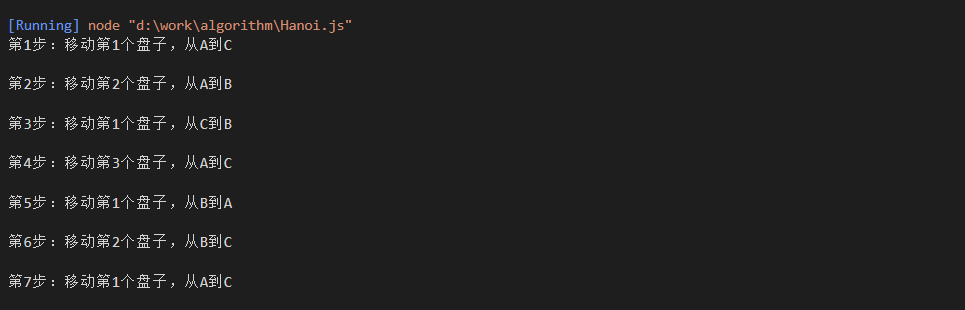


- <b> 非递归算法2 : 遍历二叉树搜索解空间

>从汉诺塔的递归算法中可知：

>当盘子的个数大于2时，汉诺塔的移动过程分为3步
- 第一步将n-1个盘从A移到C;
- 第二步将第n盘从A移到B;
- 第三步将n-1个盘从C移到B。
>如果把移动过程看作是二叉树的中序遍历，则可用二叉树与汉诺塔移动过程建立一个映射[2，3]。
>如图所示，三阶盘数，所对应的移动过程共有3!=6种移动方法。即:A→B ,A →C, B→C,B→A，C→A,C→B 6种移动方法.

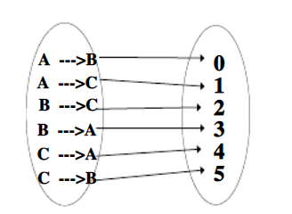

>在构造解空间树的时候，遵循由初始塔→目标塔，分解为两部分:初始塔→和中转塔→目标塔。如图所示构造n阶汉诺塔问题的解空间树与对应的解。依次类推一直到达叶节点生成满二叉树。最后对生成的二叉树中序遍历，每搜索一个结点，对应的输出它的映射值，例如:搜索到0号结点，则输出A→B，搜索到3号结点，则输出B→A，搜索到5号结点，则输出C→B.依次类推直到解空间树中所有结点搜索完成，算法结束。\

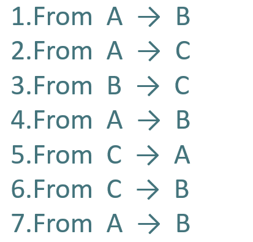
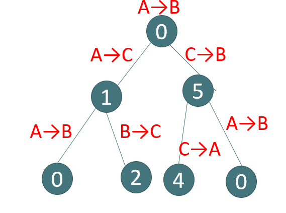

>下面给出它的中序遍历算法。将二叉树严格按照左子树在左，右子树在右画，中序遍历的结果应该是结点从左到右的一个排列。由于它是满二叉树，整个输出过程是，先输出最下层的一个结点，然后，输出上层中第一个左子树能包含该结点的结点，然后，再输出下层的下一个结点，再输出上层中第一个左子树能包含该结点的结点，直到下层的结点全部输出完为止。用一维数level_position[]存储某一层已输出的结点序号。由于该二叉树是满二叉树，上层第i个结点的左孩子一定是下层的第2i-1个结点，右孩子一定是下层的第2i个结点。这样,判断下层结点是否是上层结点的右孩子，只要判断上下层结点在其本层的编号是否构成2倍关系即可，整个算法程序实现如下:


>代码实现
```javascript
    function output(presentLevel, position, n) {
    var val;
    val = (position - 1) % 3;
    if (presentLevel % 2 == 1) {
        val = val + 3;
    }
    // 如果是奇数层，其值为3，4，5
    switch (val) {
        case 0:
            console.log(`${val}from A--->B\n`, n - presentLevel + 1);
            break;
        case 1:
            console.log(`${val}from B--->C\n`, n - presentLevel + 1);
            break;
        case 2:
            console.log(`${val}from C--->A\n`, n - presentLevel + 1);
            break;
        case 3:
            console.log(`${val}from A --->C\n`, n - presentLevel + 1);
            break;
        case 4:
            console.log(`${val}from C--->B\n`, n - presentLevel + 1);
            break;
        case 5:
            console.log(`${val}from B--->A\n`, n - presentLevel + 1);
            break;

    }
}

function main(n) {
    var level_position = [], //某层的已输出的结点序号
        i,
        sample_nub, //最后一层已输个数
        total_sample; //总个数
    console.log("\n");
    sample_nub = 0;
    total_sample = 1;
    for (i = 1; i < n; i++) 
        total_sample *= 2;
    //最底层总样点数
    for (i = 0; i <= n; i++) {
        level_position[i] = 0;
        i = n;
        level_position[i]++;
        output(i, level_position[n], n) //输出第i层某一序号的结点sample_nub++;
    }
    while (sample_nub < total_sample) {
        while (level_position[i] == 2 * level_position[i - 1]) 
            i--;
        
        //寻找把该结点作为左子树的祖先结点
        level_position[i - 1]++;
        output(i - 1, level_position[i - 1], n);
        i = n;
        level_position[i]++;
        output(i, level_position[n], n);
        sample_nub++;
    }
}
```


- 非递归解法3：二进制
>对于有 n个盘子的汉诺塔问题，按序写出所有 n 位普通二进制码 $B_n$$B_{n-1}$$...$$B_2$$B_1$，自左而右标记为第 n 位、第 n-1 位、…第2位、第1位。则 min(k|i= $B_n$$B_{n-1}$$...$$B_2$$B_1$) 表示第i步移动 k 号盘子。

>对于最小的盘子而言，总是有两种移动的可能性。若 n 为偶数，最小的盘子的移动次序是A→B→C→A→…；若 n 为奇数，最小的盘子的移动次序是A→C→B→A→…。
对于其他盘子，总是有唯一的移动可能性。
n=4的情况见下表。

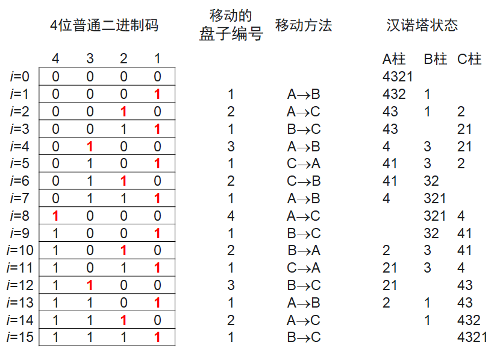

>感兴趣的自己用代码实现


## 汉诺塔的拓展

>思考题:如果塔的个数变为a,b,c,d四个，现要将n个圆盘从a全部移动到d，移动规则不变，求移动步数最小的方案。


>首先我们可以先考虑A柱子上面只有三个盘子的情况，对于A柱子上的三个盘子，我们可以先将一个盘子从A柱子移动到B柱子上面，再将第二个盘子移动到C柱子上面，最后将剩下的一个盘子移动到D柱子上面。其实对于这个过程，我们可以将其看成：首先将A柱子上面的盘子分成了两部分，第一部分上面只有一个盘子，第二部分有两个盘子，我们要做的就是先将第一部分的盘子移动到B（C也可以）柱子上面，然后将剩下的盘子移动到D柱子上面，在将B柱子上面的盘子移动到D柱子上面。

>因此算法的主要的思路就是：
>- 1，对于A柱子上面有n个盘子的时候，我们可以先将盘子分成k和n-k两个部分
>- 2，将A柱子上面的K个盘子使用Hanoi4方法将其借助C,D柱子移动到B柱子上面
>- 3，将A柱子上面剩下的n-k个盘子使用Hanoi3方法将其借助C柱子移动到D柱子上面
>- 4，将B柱子上面的K个盘子使用Hanoi4方法将其移动到D柱子上面
